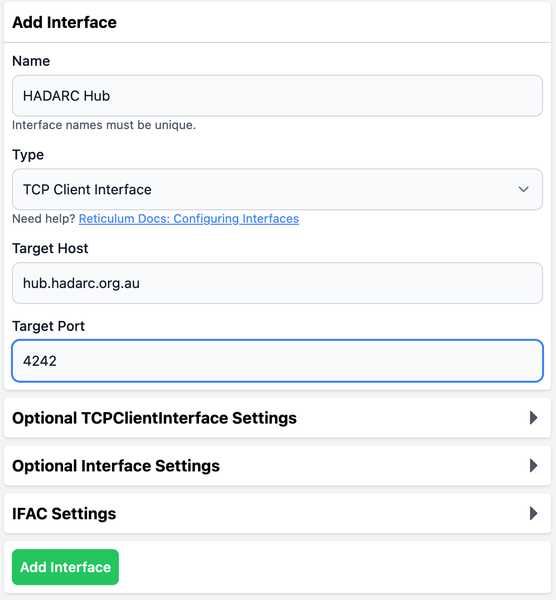
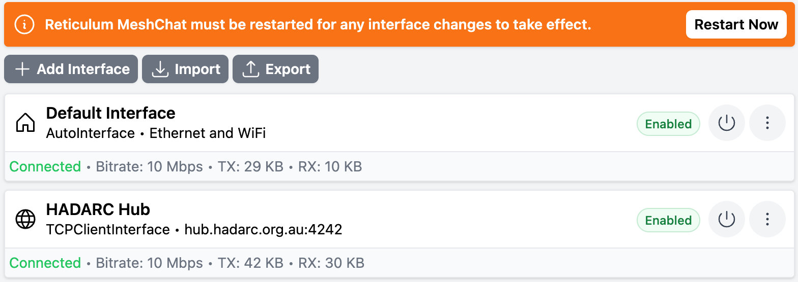

# Getting Started with Reticulum
## Installing and Configuring a LXMF (Messaging) client

In this example we will be installing the [Reticulum Meshchat](https://github.com/liamcottle/reticulum-meshchat) app that is available for Mac, Linux and Windows.

Go to [https://github.com/liamcottle/reticulum-meshchat/releases](https://github.com/liamcottle/reticulum-meshchat/releases) then download and install the most recent version of the app for your operating system.

Run the program and go to the **Interfaces** section.

Click on **+ Add Interface** and configure it as follows:

**Name:** `HADARC Hub`

**Type:** `TCP Client Interface`

**Target Host:** `hub.hadarc.org.au`

**Target Port:** `4242`

Click on **Add interface**

Click on **Restart Now**

## Start Messaging

Go to the **Messages** section

Click on **Compose**

Enter the address of the **HADARC LXMF Group** which is `0f24f850aa7cf536a557fac3621bd06e`

Type `Join` in the **Send a Message** box and click **Send**

You will get a notification you have joined the messaging group.

You can now send messages to the group.

## Browse a Micron Page on the Nomad Network

Go to the **Nomad Network** section

Click on **Open a Nomadnet URL**

Enter `429572a04001a8023bf4c2518e34f95b:/page/index.mu`

Follow the links on the Home Page, similar to using a web browser

## What's Next

Reticulum is more than a messaging system, it's a complete network stack supporting just about anything that runs over networks. This includes things like file transfers and even real time traffic such as voice and video.

Probably the most interesting aspect for Amateur Radio enthusiasts is the ability of Reticulum to work over low speed radio links.

To that end a number of HADARC members are setting up LoRa radios around the Hornsby area. If you are interested in participating please follow this guide and send a message to the **HADARC LXMF Group** asking how to set up an RNode and where the existing RNodes are located

Read more at [https://reticulum.network](https://reticulum.network)

